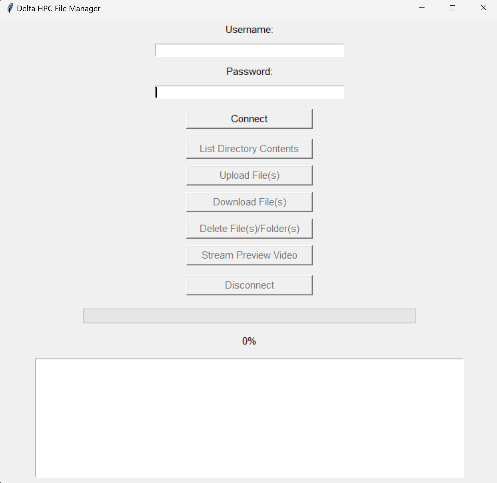

# Delta HPC Server File Management Application

This desktop application provides a simple graphical interface to manage files on the Delta HPC server at NCSA, including uploading, downloading, and managing directories via SFTP. It is designed to work on both macOS and Windows.

Released Version Demo Video: https://youtu.be/FUhbKD9mmDQ
Updated Version Demo Video: https://youtu.be/OaHXeXQHM5U

## Features

- **Connect to Delta HPC Server:** Connect to the Delta HPC server using your username and password, with support for Duo MFA authentication.
- **Manage Directories:** View and manage files and directories on the server. Directories have a yellow text color.
- **Upload Files:** Upload files to a specific directory on the server. The application allows you to create directories if they do not exist.
- **Download Files:** Download files from the server to your local machine. The application allows you to preview videos before downloading.
- **Delete Files/Folders:** Delete files and folders from the server.
- **Stream Preview Video:** Preview videos up to 5 seconds.
- **Progress Tracking:** Track the progress of file uploads and downloads with a progress bar and percentage indicator.

## Installation

### Windows

1. **Download and Extract:**
   - Download the `DeltaHPC_FileManager.zip` file from the release page.
   - Extract the contents `dist_windows/DeltaHPC_FileManager.exe` to a desired location on your computer.

2. **Run the Application:**
   - Double-click `DeltaHPC_FileManager.exe` to run the application.

### macOS

1. **Download and Extract:**
   - Download the `DeltaHPC_FileManager.zip` file from the release page.
   - Extract the `dist_macos/DeltaHPC_FileManager.app` file to your Applications folder or a desired location.

2. **Run the Application:**
   - Double-click `DeltaHPC_FileManager.app` to run the application.

## Prerequisites

- **Python 3.6+**
- The application bundles all necessary Python packages, but you must have the following installed on your system:
  - `paramiko`
  - `tkinter` (included with Python)

## Usage

1. **Connect to the Server:**
   - Enter your Delta HPC server username and password.
   - Click "Connect to Server."
   - Complete Duo MFA authentication.

2. **List Directory Contents:**
   - Click "List Directory Contents."
   - View the contents of a directory on the server.
   - Directories are listed with a `**` prefix.

3. **Upload a File:**
   - Click "Upload File."
   - Choose files to upload from your local machine.
   - Select the directory on the server to upload the file.
   - Monitor the upload progress.

4. **Download a File:**
   - Click "Download File."
   - Select a file on the server.
   - Choose a location on your local machine to save the file.
   - Monitor the download progress.

4. **Delete a File/Folder:**
   - Click "Delete File."
   - Select a file or folder on the server to delete

4. **Stream Preview a Video:**
   - Click "Stream Preview Video."
   - Select a video on the server to preview

6. **Disconnect:**
   - Click "Disconnect" to close the SFTP session and disconnect from the server.

## Troubleshooting

- **Connection Issues:**
  - Ensure you are connected to the internet.
  - Verify that your username and password are correct.
  - Check that the Duo MFA prompts are completed as expected.

- **Upload/Download Failures:**
  - Ensure the file paths are correct.
  - Check that you have sufficient permissions on the server.
  - Verify that the server directory exists or can be created.

## Contributing

If you'd like to contribute to this project, please fork the repository and submit a pull request.
